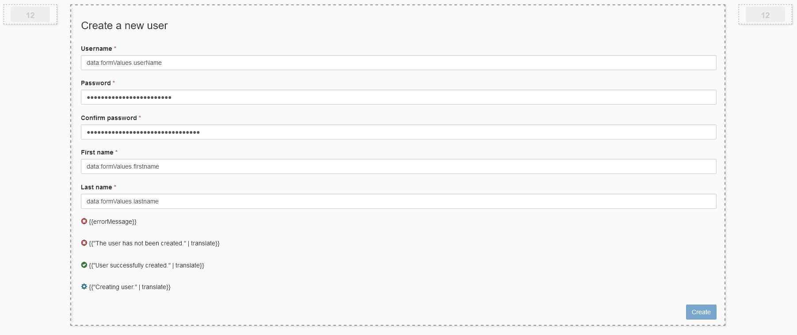
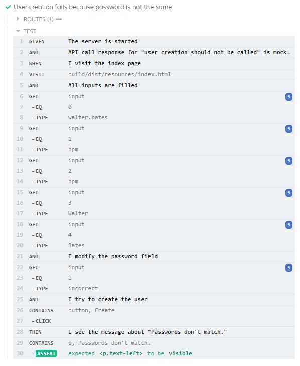

# How to test an UI Designer page using Cypress

It is not enough to make an UI Designer page, testing it is very important as well. 
For this reason, our team decided to move towards an e2e framework that is fast to set up and allows us to write tests efficiently. 
We decided to use [Cypress](https://www.cypress.io/), a open-source, javascript framework that lets you write Given-When-Then semi-structured tests.

In this article I will go over an UI Designer page that lets you create a user and two tests that were made for the page. 
You can find all of these in this [github](https://github.com/bonitasoft-labs/bonita-uid-page-cypress-test) repository. 
The two tests that I will talk about aren’t the only ones that you will find in the repository and if you want to see more examples, you can clone the repository and then check them out by yourself.

### Diving into the page structure
Let’s start with the page. It has a form container with multiple fields that will ask for different information in order to create a new user. 
You can also see some messages that will be displayed in case of errors and success, as well as a loading message. 
There is also a hidden functionality that makes the success or error messages disappear after three seconds if the user makes any action on the page. 
We usually use this feature in order to mimic a toast and thus not clog the user's screen.


## The test choices

Without further ado, let’s talk about tests. 
Cypress tests are made from two distinct parts. 
The first is about writing the test scenarios in one file and the second is about explaining with code what each line of the scenario will do.
The cypress-cucumber-preprocessor library is used in order to write scenarios in the Given-when-then style.

The two tests that I am going to talk about are :
- A failure in the creation of the user because the passwords don’t match
- The loader being displayed while the user is being created

I chose the first because it is a test that we have done and redone multiple times in our pages, but with a little subtlety. In most of the cases, we are checking that a correct API call is made, with the correct parameters and the correct response. In this case, none of that is necessary because the test for password equality is made client-side. Thus the additional thing that is checked is if no API call is made because none is needed. 
The second was chosen because it depicts an use-case that seemed pretty interesting to me, and also because the building blocks of the scenario might be useful in a variety of situations, as, for example, the test for checking if the message disappears after three seconds.

## Testing user creation failure because the password is not the same

Let’s talk about the first test scenario. 
```code 
Given The server is started
And API call response for "user creation should not be called" is mocked
When I visit the index page
And All inputs are filled
And I modify the password field
And I try to create the user
Then I see the message about "Passwords don't match."
```
The idea for this test is to both verify that there is no API call that is made towards the user API, and also that there is a message saying that passwords don't match. 
To verify that there is no API call that is made, we can make a route towards the user API without actually creating a response, but only by throwing an error.
```code
cy.route({
    method: "POST",
    url: userAPI,
    onRequest: () => {
        throw new Error("This should have not been called");
    }
});
```
In order to verify that everything works according to plan, we visit the page.
```code
cy.visit(url);
```
After that, we fill all inputs with information.
```code
cy.get("input").eq(0).type("walter.bates");
cy.get("input").eq(1).type("bpm");
cy.get("input").eq(2).type("bpm");
cy.get("input").eq(3).type("Walter");
cy.get("input").eq(4).type("Bates");
```
Followed by modifying the password to not match the confirm password value.
```code
cy.get("input").eq(1).type("incorrect");
```
And the last action on the page being that of creating the user.
```code
cy.contains("button", "Create").click();
```
After we have setup this specific situation, we want to test that the "Passwords don't match." message is present on the page.
```code
cy.contains("p", message).should("be.visible");
```
After launching the test runner, we can see that the test is executed and is successful.


## Testing the loader being displayed while the user is being created

The scenario for this test is based on the display of a loader and checking that it disappears after five seconds.
```code
Given The server is started
And API call response for "user created after delay" is mocked
When I visit the index page
And All inputs are filled
And I try to create the user
Then The loader is shown
When I wait for 5000 delay
Then I see the message about "User successfully created."
And The loader is not shown
```
As you can see, some parts of this test are the same as in the first test. The main things that are different are the definition of the API mock, checking that the loader is shown, waiting for 5 seconds and checking the end-state of the page.
Mocking the API response after 5 seconds lets us have a moment during which the response has not arrived from the user API and thus the loading would be shown.
The response is the same as the one that you would get from the Portal, which lets us be very close to reality.
```code
cy.fixture("json/userCreatedResponse.json").as("userCreated");
cy.route({
    method: "POST",
    url: userAPI,
    delay: 5000,
    response: "@userCreated"
}).as("userCreatedRoute");
```
While the user is created, we verify that the loader is shown.
```code
cy.get(".glyphicon.glyphicon-cog.gly-spin").should("be.visible");
cy.contains("p", "Creating user.").should("be.visible");
```
After which we wait for 5 seconds.
```code
cy.wait(time);
```
And after 5 seconds, when the response arrives, we check that the message disappears.
```code
cy.get(".glyphicon.glyphicon-cog.gly-spin").should("not.be.visible");
cy.contains("p", "Creating user.").should("not.be.visible");
```

<br/>
As you can see, these tests don't take a long time to write and can be very powerful. 
Awesome! Now you know how to test a UI Designer page with Cypress! You can also check our [web-pages project](https://github.com/bonitasoft/bonita-web-pages/uid-pages) containing pages that we are currently developing.
